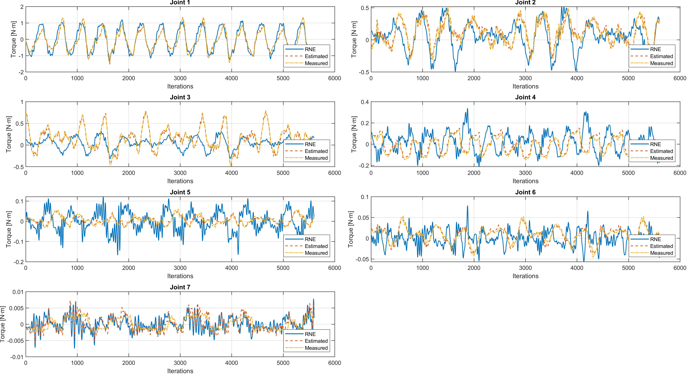
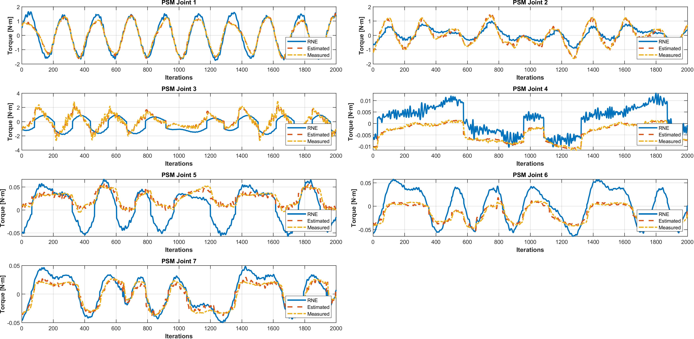

# RBE501 Final Project: Robot Dynamics and Control

## Overview

This repository contains the implementation and analysis of robot dynamics and control for the Patient Side Manipulator (PSM) and Master Tool Manipulator (MTM) of the da Vinci Robotics Kit. The project focuses on modeling, simulating, and validating the dynamics of these robotic systems using the Recursive Newton-Euler (RNE) algorithm and comparing the results with experimental data and theoretical estimates.

## Repository Structure

The repository is organized as follows:

### Main Files

- `MTM/MTM_RNE.m`: Implements the Recursive Newton-Euler (RNE) algorithm for the MTM, compares results with experimental and estimated torques, and visualizes the impact of friction, spring, and motor inertia on joint torques.
- `PSM/PSM_RNE_V2.m`: Similar to `MTM_RNE.m`, but for the PSM. Includes torque calculations and comparisons.
- `animate_traj.m`: Animates the trajectory of the robot manipulator.

### Models

- `models/psm/`: Contains URDF and Xacro files for the PSM robot model. See the [README](models/psm/README.md) for details.
- `models/mtm/`: Contains URDF and Xacro files for the MTM robot model. See the [README](models/mtm/README.md) for details.

### Trajectories

- `traj/`: Contains trajectory data for testing and validation. Taken from Yan Wang et al. (2019) and modified for this project. Videos of some of the trajectories are available in the `media/` folder.

## Key Features

1. **Recursive Newton-Euler Algorithm**:
   - Calculates joint torques based on robot dynamics.
   - Includes effects of friction, spring forces, and motor inertia.

2. **Forward Kinematics**:
   - Implements both Denavit-Hartenberg (DH) and Product of Exponentials (PoE) methods for validation.

3. **Visualization**:
   - Plots torque comparisons between RNE results, estimated values, and measured data.
   - Animates robot trajectories.

4. **Error Analysis**:
   - Computes RMSE (Root Mean Square Error) between RNE results and experimental data.

## How to Use

1. Clone the repository:

   ```bash
   git clone https://github.com/your-username/RBE501-Final-Project.git
   cd RBE501-Final-Project
   ```

2. Open MATLAB and add the repository to the MATLAB path:

   ```matlab
   addpath(genpath('path/to/RBE501-Final-Project'));
   ```

3. Run the main scripts:
   - For MTM dynamics: `MTM/MTM_RNE.m`
   - For PSM dynamics: `PSM/PSM_RNE_V2.m`

## Dependencies

- MATLAB R2023a or later.
- MATLAB Robotics Toolbox.

## Results

The project includes:

- Torque comparison plots for each joint.
  - MTM Comparison:
    
  - PSM Comparison:
    
- Analysis of the impact of friction, spring forces, and motor inertia.
- RMSE calculations to quantify the accuracy of the RNE algorithm.

## References

- Yan Wang et al., "Dynamic Modeling of the dVRK Manipulators," IEEE Robotics and Automation Letters, 2019.
- MATLAB Robotics Toolbox documentation.

## Acknowledgments

- The robot models are sourced from [WPI-AIM/dvrk_env](https://github.com/WPI-AIM/dvrk_env.git) and modified for this project.
- Special thanks to Professor Loris Fichera (WPI) for guidance on robot dynamics.

## License

This project is under GNU V3. Please refer to the original sources for licensing details of the robot models.
